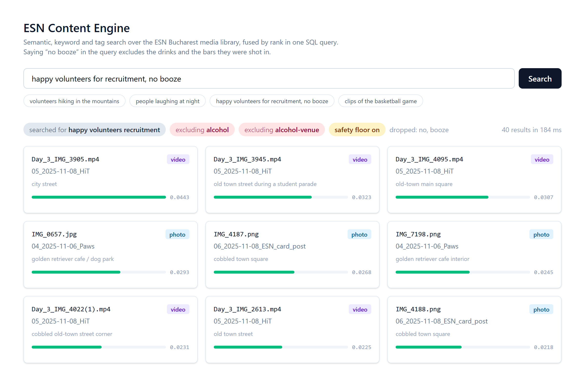
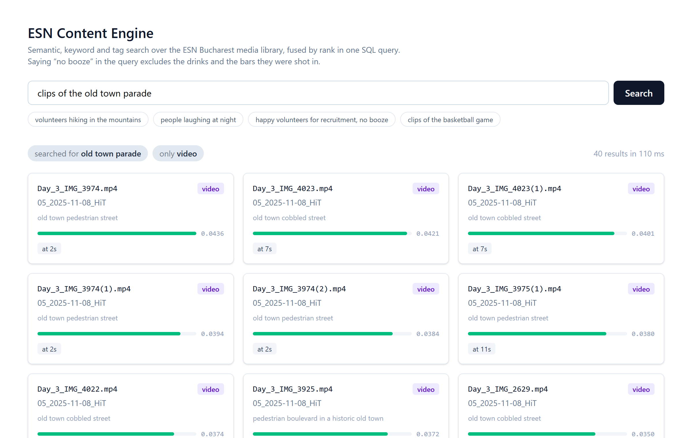
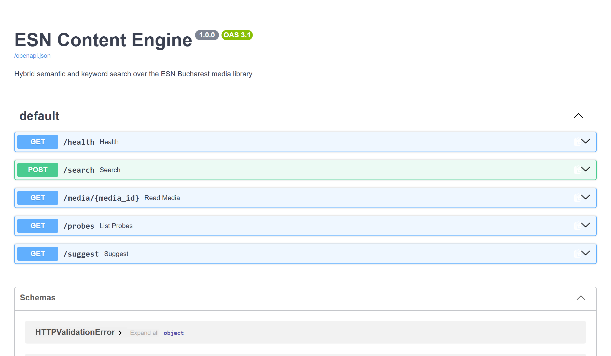

# ESN Content Engine

[](https://github.com/V1c99/esn-content-engine/actions/workflows/ci.yml)

Search over the photos and videos ESN Bucharest shot during one semester, so that finding
footage for an Instagram reel does not mean scrolling through 2,334 files. Semantic search,
keyword search and tag search run together in one SQL query and are combined by rank.

I built it because I run the media for the association and I was losing hours to it. It is
installed on the communications team's machines now and other volunteers use it too.



## Retrieval and exclusions

Somebody writing a recruitment post types something like

> happy volunteers for a recruitment collage, no booze

The query has to do two things. Find the right clips, and reliably not return the wrong ones.
The second one matters more here, so the exclusion does not run over the results afterwards.
It is a CTE at the top of the query that every retriever joins:

```sql
WITH eligible AS (
    SELECT media.id FROM media
    WHERE NOT media.alcohol_visible
      AND NOT (media.place ~* '\yclub\y' AND media.place !~* '\ystudent club\y' OR ...)
),
semantic AS (SELECT ... FROM media_embedding e JOIN eligible ON eligible.id = e.media_id ...),
lexical  AS (SELECT ... FROM media JOIN eligible ON eligible.id = media.id ...),
tags     AS (SELECT ... FROM tag_match(:q) t JOIN eligible ON eligible.id = t.media_id ...)
```

An excluded item cannot come back through any of the three, because none of them can see it.
The old version of this engine had two endpoints and only one of them applied the rules, which
is what [ADR-0004](docs/adr/0004-one-retrieval-path.md) is about.

## Rank fusion

The three retrievers produce scores that cannot be compared. Cosine distance is 0 to 2,
`ts_rank_cd` is an unbounded float that depends on document length, and the tag score is a sum
of inverse document frequencies. Instead of normalising them and picking weights, each one
votes with its rank:

```sql
SUM(1.0 / (60 + rank))
```

Each retriever contributes `1 / (k + rank)`, so nothing has to be normalised and no weights
have to be tuned. The 60 is a smoothing constant that stops the top hit of any single
retriever from deciding the whole result on its own. [ADR-0003](docs/adr/0003-reciprocal-rank-fusion.md)
covers what this costs.

A 60 second clip has 60 vectors in the index, so the semantic side is collapsed to the best
second per item before the ranks are handed out. Without that, one clip filled the whole page.
The second that matched is carried through, so a video result points at the moment rather than
at the file.



## Running the stack

```bash
docker compose up
```

Postgres with pgvector, Redis, the API on `http://localhost:8000` with generated docs at
`/docs`, and the dashboard on `http://localhost:5173`.



Redis caches the whole search response for five minutes, which takes a repeat of the same
query from 167.6 ms to 7.3 ms. It is optional: without `REDIS_URL` the search just runs
every time, and if Redis goes down the request still gets answered.

The CLIP weights are not in the repository. Only the text encoder is needed to search, so put
`clip_text.onnx` (254 MB) and `tokenizer.json` in `models/` before starting, and the compose
file mounts them read only.

To load the library into an empty database:

```bash
alembic upgrade head
python scripts/import_library.py path/to/library.db
```

## Dataset

Every number below came out of a query against the loaded database.

| | |
|---|---|
| Items | 2,334 (1,755 photos, 579 videos) |
| Embeddings | 8,919 vectors: one per item, plus 6,585 sampled video seconds |
| Dimensions | 512, from CLIP ViT-B/32 through ONNX Runtime |
| Tag vocabulary | 11,139 terms over 247,232 tag rows |
| Probes | 23 trained classifiers, cross-validated |

## Measurements

| Measurement | Result |
|---|---|
| HNSW recall against an exhaustive scan, 200 queries at k=40 | mean 0.9958, worst 0.950, 170/200 identical |
| Same query, HNSW against exhaustive | 3.3 ms against 18.3 ms, median |
| Search through the API, cache miss | 167.6 ms median |
| The same search again, served from Redis | 7.3 ms median |
| Search in process, no HTTP and no cache | 23 ms to 40 ms |
| Query text to 512 numbers | 21.8 ms median |
| Bar and club items reaching the top 40 of five "no alcohol" briefs | 81 with the visible-alcohol label alone, 0 with the venue rule |

The venue rule flags 630 items where the visible-alcohol label flags 526, and 151 of those are
items the label alone would have missed. On the brief "people dancing, no booze", all 40
results were shot in a bar or a club before the rule existed.

## Probe accuracy

23 classifiers are trained on the CLIP embeddings against hand labels. They are reported with
the accuracy they were measured at, because two of them are not trustworthy:

| probe | positives | ROC-AUC | verdict |
|---|---|---|---|
| animals | 251 | 0.999 | strong |
| alcohol | 526 | 0.985 | strong |
| outdoors | 1570 | 0.978 | strong |
| happy | 1112 | 0.917 | strong |
| hero | 527 | 0.797 | **weak** |
| good_quality | 1260 | 0.778 | **weak** |

`hero` and `good_quality` encode taste and CLIP does not have taste. They are marked weak
everywhere they appear, in the API and in the interface. `smoking` has 15 positives and
`unusable` has 8, which is too few for their average precision to mean much, so they are hints
and not filters.

None of the probes are used for exclusions. Those run as SQL over the vision label columns, so
a weak probe cannot decide whether something is safe to publish.

## Limitations

There is no ranking model and no learning from clicks. The order comes from rank fusion over
three retrievers and nothing adapts to what anybody picked.

The search is English only. `websearch_to_tsquery('english', ...)` stems English, and the
labels are in English, so a Romanian query only works through the semantic side.

The tag search is exact term matching. The old engine had typo correction and an ontology that
expanded `puppy` to `dog`, and none of that is here yet. A misspelled word only reaches the
semantic retriever.

The media files are not in the repository, they are not mine to publish. The dashboard shows
what is known about each result rather than a thumbnail.

There is no authentication. Anybody who reaches the port can search.

## Repository layout

`search/` has the query parsing, the exclusion rules and the fused SQL. `embeddings/` is CLIP
on ONNX Runtime. `db/` is the models and the session. `api/` is FastAPI. `probes/` holds the
accuracy threshold that decides which probes get a warning.

`frontend/` is React 19 and TypeScript with Vite, and its API client is generated from the
OpenAPI schema with `npm run generate:api`, so no request or response type is written by hand.

`docs/architecture.md` has the diagrams. `docs/adr/` has four decisions and what each one
cost.

## Development

```bash
ruff check . && ruff format --check . && mypy src && pytest
```

72 tests, 85% line coverage. The ones in `tests/contract/` are each named after the bug they
prevent, so `test_a_horse_drinking_at_a_trough_is_not_a_bar` is a real case from the library
that a substring match got wrong. They build their own database from the migration and seed a
small library containing every trap, so they run on an empty Postgres and never need the model
weights at all.
