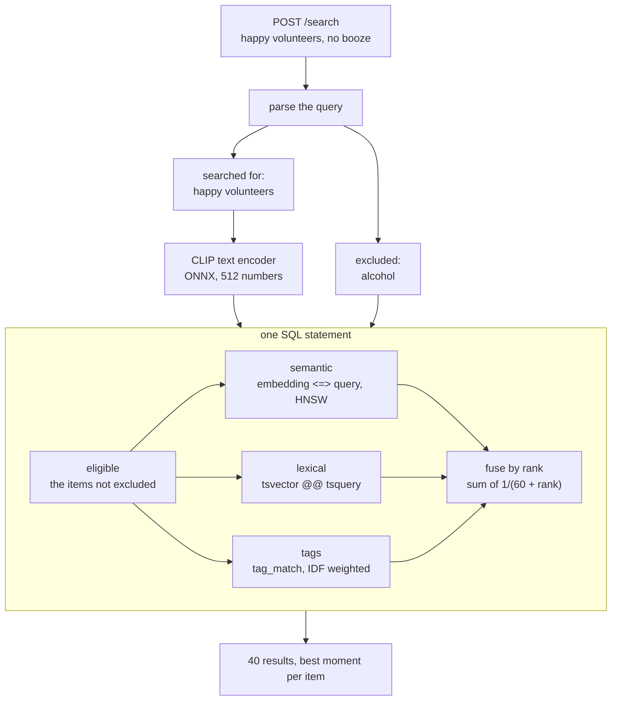
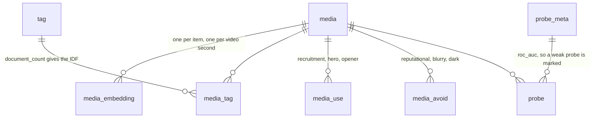

# Architecture

## Request flow

All three retrievers join `eligible`, so an excluded item cannot come back through any of
them. There is one search endpoint, see ADR-0004.

## Schema

`media_embedding` holds both levels. A photo or a whole video sits at `timestamp_s = 0`, and
a sampled video frame sits at the second it came from. The timestamp is part of the primary
key, which is what lets a search return the moment inside a clip instead of the clip.

The library has 2,334 items and 8,919 vectors: 2,334 for whole items and 6,585 video frames.

## Exclusion rules

The alcohol label records what a labeller could see in the frame, so a clip shot inside a pub
with no drink in shot passes it. A second rule matches the place and the activity instead.
Both are predicates in the `eligible` CTE.

All of the matching is word boundary only. Substring matching flagged "public" as pub,
"beginning" as gin and "barrier" as bar, which was 208 false suspects in the old engine. Two
exemptions are real cases in this library: a university "student club" room is not a
nightclub, and there are two clips of a horse drinking at a trough.

Measured on the real library: the visible-alcohol label flags 526 items, the venue rule flags
630, and 151 of those 630 are items the label alone would have missed.

## Out of scope

No Kubernetes, no message queue, no separate search service. It is one API process, one
Postgres and one Redis, and Postgres does the vector search, the keyword search and the tag
scoring in the same query. The library is 2,334 items, so none of that would earn its keep.
